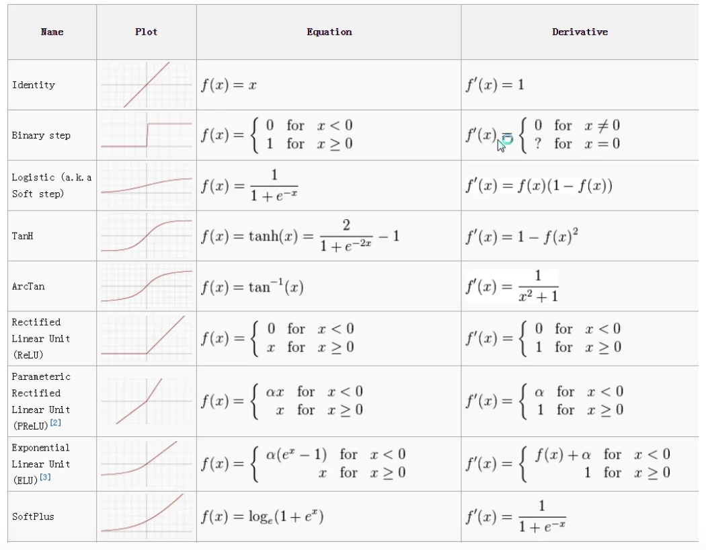
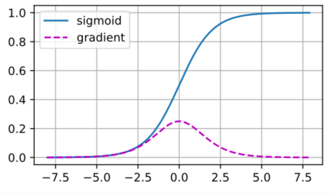

# Activation Functions
- [Source](https://medium.com/the-modern-scientist/an-overview-of-activation-functions-in-deep-learning-97a85ac00460)
- Swish
  - $\frac{x}{1+e^{-\beta x}}$
- GeLU
  - $xP(X \leq x)$ for $X \sim \mathcal{N}(0,1)$
  - [Source](https://paperswithcode.com/method/gelu)
- Exploding/Vanishing gradients
  - Since the propagation of gradients into weights goes through (multiple layers of) neurons, we expect any exploding/vanishing problems to affect both neurons and weights.
- Effects of different activations
  - Sigmoid 
    - Activations tend to suffer from the vanishing gradient problem because the gradient vanishes both when its inputs are large and when they are small (and this problem is compounded through backpropagation).
    - Also, this means that activations would likely stay around 0, and the lack of intra-layer activation variance would likely limit the expressiveness of the model.
      - 
  - ReLU
    - ReLU solves this, but is susceptible to dead neurons.
    - It should be noted that dead neurons are especially problematic in the input layer. As the input does not change over epochs (the training set is kept as it is), training the network cannot turn those neurons back active. Still, the input data has usually a sufficiently high standard deviation to reduce the risk of dead neurons.