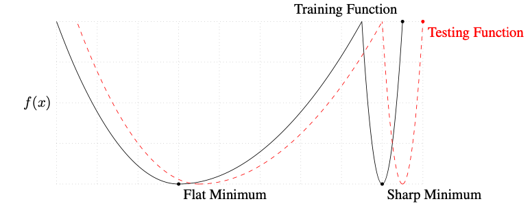

# Optimization and Regularization

## Regularization

- For general notes about regularization, refer to [Statistical Learning Theory](../../classical/03_statistical_learning_theory)
- This section shall focus on regularization for deep learning, which is pertinent because neural network's expressiveness leave them vulnerable to overfitting.
- Parameter regularization 
  - This is often referred to with the `weight_decay` parameter in PyTorch. 
  - Usually, we leave the basis terms unregularized, since each bias controls only a single variable. This means that we do not induce too much variance by leaving the biases unregularized.

## First-Order Methods

- Stochastic Gradient Descent (SGD) is mainly done for computational reasons. The expectation of a minibatch is still unbiased.
- Size of learning rate:
  - To the extent that the function that we minimize can be approximated well by a quadratic function, 
    - $f(\mathbf{x}-\epsilon\mathbf{g}) = f(\mathbf{x}) - \epsilon\mathbf{g^{\top}g}+\frac{1}{2}\epsilon^2\mathbf{g^{\top}Hg}$
    - Optimal step size $\epsilon^* = \frac{\mathbf{g^{\top}g}}{\mathbf{g^{\top}Hg}}$
    - In the worst case when $\mathbf{g}$ aligns with the corresponding eigenvector, $\epsilon^* = \frac{1}{\lambda_{max}}$
- Condition number
  - When the condition number of the Hessian is high, gradient descent performs poorly. 
  - Gradient descent is unaware of the difference in second derivatives, so it does not know to explore in the direction where the derivative remains negative for longer.
  - [Source](https://www.deeplearningbook.org/contents/numerical.html)
    - [Lippe](https://github.com/phlippe/uvadlc_notebooks/blob/master/docs/tutorial_notebooks/tutorial4/Optimization_and_Initialization.ipynb) calls this a Pathological curve.
- Momentum
  - ToDo: Why?
    - Re: pathogolocial curves, GD oscillates while momentum helps
    - SGD oscillates while algorithms with momentum nicely converge because the changing direction of the gradient cancels itself out.
- Adam 
  - Algo
    - $m^{(t)} = \beta_1 m^{(t-1)} + (1 - \beta_1)\cdot g^{(t)}$
    - $v^{(t)} = \beta_2 v^{(t-1)} + (1 - \beta_2)\cdot \left(g^{(t)}\right)^2$
    - $\hat{m}^{(t)} = \frac{m^{(t)}}{1-(\beta_1)^t}, \hat{v}^{(t)} = \frac{v^{(t)}}{1-(\beta_2)^t}$
    - $w^{(t)} = w^{(t-1)} - \frac{\eta}{\sqrt{\hat{v}^{(t)}} + \epsilon}\circ \hat{m}^{(t)}$
  - Intuition:
    - We want the gradients of _each param to have similar norm, note that we're not replacing the overall $\eta$, but rather perturbing each term separately. 
      - ToDo: Why?
    - $m^{(t)}$ is an EMA of the gradients
    - $v^{(t)}$ is an EMA of the gradient norms
    - $\epsilon$ is a small constant used to improve numerical stability for very small gradient norms.
    - $1-(\beta_1)^t$ and  $1-(\beta_2)^t$ add as a bias correction term and converge to 1 as $t$ increases. 
      - Adaptive learning rate. ToDo: Understand more about this. 
        - Note that implementation only increments $t$ whenever update_param is called. Curious to know how this interacts with say, dropout. Is this how PyTorch implements Adam?
  - Vs other algorithms:
    - Adam is the most commonly used optimizer in Deep Learning as it usually performs better than other optimizers, especially for deep networks.
    - Adaptive learning rate helps when initialization is bad.
    - Steep optima:
      - SGD: Touches steep gradient and then overshoots 
      - SGDM: Momentum overshoots 
      - Adam: Adaptive learning rate allows it to stay in minimum - why?
    - But there are scenarios that SGD (with momentum) may generalize better as Adam tends to overfit.
      - Adam can get stuck in local optima while SGD finds the wider minima that tend to generalize better.
      - [Source](https://arxiv.org/pdf/1609.04836)

## Second-Order Methods

- Newton's method
  - Suppose we want to minimize $f(\mathbf{x})$.
  - We use the following update rule: $\mathbf{x}_{k+1}=\mathbf{x}_k-H\left(\mathbf{x}_k\right)^{-1} \nabla f\left(\mathbf{x}_k\right)$
    - $f\left(\mathbf{x}_k+\Delta \mathbf{x}\right) \approx f\left(\mathbf{x}_k\right)+\nabla f\left(\mathbf{x}_k\right)^{\mathrm{T}} \Delta \mathbf{x}+\frac{1}{2} \Delta \mathbf{x}^{\mathrm{T}} H \Delta \mathbf{x}$
    - $\nabla f\left(\mathbf{x}_k+\Delta \mathbf{x}\right) \approx \nabla f\left(\mathbf{x}_k\right)+H \Delta \mathbf{x}$
    - Setting the gradient to be zero gives our update function.
  - Nature of stationary point
    - While in gradient descent, we can ensure that we're moving toward a minima, Newton's method is attracted to all stationary points.
    - Therefore, when the loss function is nonconvex, this method could instead get us to local **maxima**
      - Regularization methods are used to prevent this
  - The time complexity is understandably dominated by inverting the Hessian, which we try to address in Quasi-Newton methods
- Fisher's scoring replaces $H$ with it's expectation, the negative of the Fisher's Information matrix. The advantage of doing so is that this is always positive semi-definite and therefore can aid convergence issues.
- Quasi-Newton methods
  - Quasi-Newton methods avoid computing the inverse of the Hessian by _estimating it through iteration_. Concretely, it uses the following update step:
  - $B_{k+1}\left[\mathbf{x}_{k+1}-\mathbf{x}_k\right]=\nabla f\left(\mathbf{x}_{k+1}\right)-\nabla f\left(\mathbf{x}_k\right)$
    - The intuition here is that we don't want to compute the inverse,  so we iterate on the equation before that.
- Goodfellow's chapter 8 has a lot of interesting discussion here