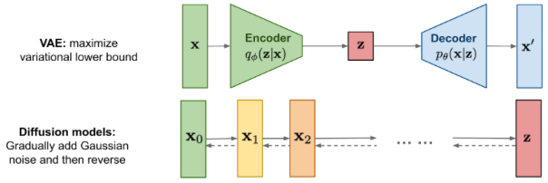

# Diffusion

- Much like VAEs, Diffusion models are another type of generative model. 
- [Source](https://lilianweng.github.io/posts/2021-07-11-diffusion-models/)
- There are a few ways that diffusion is different from VAEs
  - $\mathbf{z}$ has same dimension as $\mathbf{x}_0$
  - The forward process (encoding) is done not by a neural network, but by simply adding Gaussian noise. 
  - The backward process (decoding) is still achieved by a neural network, but instead of predicting the image $\mathbf{x}_0$, we predict the noise $\mathbf{x}_t$ - $\mathbf{x}_0$. 
- Theoretical Details:
  - [Source](https://lilianweng.github.io/posts/2021-07-11-diffusion-models/)
  - Data points are assumed to come from a real data distribution $\mathbf{x}_0 \sim q(\mathbf{x})$
  - We define a forward diffusion process in which we add small amount of Gaussian noise to the sample in $T$ steps, producing a sequence of noisy samples $\mathbf{x}_1, \ldots, \mathbf{x}_T$. The step sizes are controlled by a variance schedule $\{\beta_t \in (0,1)\}_{t=1}^T$. 
    - $q\left(\mathbf{x}_t \mid \mathbf{x}_{t-1}\right) \sim \mathcal{N}\left(\mathbf{x}_t ; \sqrt{1-\beta_t} \mathbf{x}_{t-1}, \beta_t \mathbf{I}\right)$ 
    - $q\left(\mathbf{x}_{1: T} \mid \mathbf{x}_0\right)=\prod_{t=1}^T q\left(\mathbf{x}_t \mid \mathbf{x}_{t-1}\right)$
    - Note that this implies $q\left(\mathbf{x}_t \mid \mathbf{x}_0\right) \sim\mathcal{N}\left(\mathbf{x}_t ; \sqrt{\bar{\alpha}_t} \mathbf{x}_0,\left(1-\bar{\alpha}_t\right) \mathbf{I}\right)$, where $\bar{\alpha}_t = \prod_{i=1}^t (1 - \beta_t)$
      - This permits us to sample from $\mathbf{x}_t$ directly given $\mathbf{x}_0$
      - In addition, we can reparameterize $\mathbf{x}_t \mid \mathbf{x}_0$ = $\sqrt{\bar{\alpha}_t} \mathbf{x}_0+\sqrt{1-\bar{\alpha}_t} \pmb{\epsilon}$ for $\pmb{\epsilon} \sim \mathcal{N}(\mathbf{0}, \mathbf{I})$
  - If we can sample from $q(\mathbf{x}_{t-1} \mid \mathbf{x}_t)$, **we can recreate the true sample from a Gaussian noise input**, $\mathbf{x}_t \sim \mathcal{N}(\mathbf{0, I})$.
    - But we can't! So we use a neural network to model $p_\theta,$ where we have
      - $p_\theta\left(\mathbf{x}_{0: T}\right)=p\left(\mathbf{x}_T\right) \prod_{t=1}^T p_\theta\left(\mathbf{x}_{t-1} \mid \mathbf{x}_t\right)$
      - $p_\theta\left(\mathbf{x}_{t-1} \mid \mathbf{x}_t\right) \sim \mathcal{N}\left(\mathbf{x}_{t-1} ; \pmb{\mu}_\theta\left(\mathbf{x}_t, t\right), \mathbf{\Sigma}_\theta\left(\mathbf{x}_t, t\right)\right)$
    - What is a good $p_\theta$? One that maximizes $p_\theta(\mathbf{x}_0)$.
      - As before, we instead maximize the variational lower bound
        - $\log p_\theta(\mathbf{x}_0) \geq \log p_\theta(\mathbf{x}_0) - D_{\mathrm{KL}}\left(q\left(\mathbf{x}_{1: T} \mid \mathbf{x}_0\right) \| p_\theta\left(\mathbf{x}_{1: T} \mid \mathbf{x}_0\right)\right)$, which expands to 
        - -$\mathbb{E}_q[\underbrace{D_{\mathrm{KL}}\left(q\left(\mathbf{x}_T \mid \mathbf{x}_0\right) \| p\left(\mathbf{x}_T\right)\right)}_{L_T}+\sum_{t>1} \underbrace{D_{\mathrm{KL}}\left(q\left(\mathbf{x}_{t-1} \mid \mathbf{x}_t, \mathbf{x}_0\right) \| p_\theta\left(\mathbf{x}_{t-1} \mid \mathbf{x}_t\right)\right)}_{L_{t-1}} \underbrace{-\log p_\theta\left(\mathbf{x}_0 \mid \mathbf{x}_1\right)}_{L_0}]$ [Source, Appendix A](https://arxiv.org/pdf/2006.11239)
        - This form is nice because:
          - $L_1, \ldots, L_T$ compares two Gaussian distributions and therefore they can be computed in closed form.
          - $L_T$ is constant and can be ignored during training because $q$ has no learnable parameters and $\mathbf{x}_T$ is a Gaussian noise
          - [Ho et al. 2020](https://arxiv.org/pdf/2006.11239) models $L_0$ using a separate discrete decoder (Section 3.3).
          - Hence, moving forward, we focus on $L_1, \ldots, L_{T-1}$. 
        - Minimizing $L_{t-1}$ 
          - Returning to $p_\theta\left(\mathbf{x}_{t-1} \mid \mathbf{x}_t\right) \sim \mathcal{N}\left(\mathbf{x}_{t-1} ; \pmb{\mu}_\theta\left(\mathbf{x}_t, t\right), \mathbf{\Sigma}_\theta\left(\mathbf{x}_t, t\right)\right)$,
            - Unlike VAEs, where we optimize for both mean and covariance, we instead _set_ $\mathbf{\Sigma}_\theta$ and focus on optimizing for $\pmb{\mu}_\theta$ ([Details, Section 3.2](https://arxiv.org/pdf/2006.11239))
          - Using the reparameterization of $\mathbf{x}_t \mid \mathbf{x}_0$, we find that $L_{t-1}$ is minimized when 
          - $\pmb\mu_\theta(\mathbf{x}_t, t) = \frac{1}{\sqrt{1 - \beta_t}}\left(\mathbf{x}_t-\frac{\beta_t}{\sqrt{1-\bar{\alpha}_t}} \pmb{\epsilon}\right)$
            - In other words, having $\pmb\epsilon_\theta$, a function approximator intended to predict $\pmb\epsilon$ from $\mathbf{x}_t$, is equivalent to having $\pmb\mu_\theta$. 
          - Training
            - Reparameterizing $\pmb\mu_\theta$ with $\pmb\epsilon_\theta$, we find that we can rewrite our loss as: 
            - $\mathbb{E}_{\mathbf{x}_0, \pmb{\epsilon}}\left[\frac{\beta_t^2}{2 \sigma_t^2 \alpha_t\left(1-\bar{\alpha}_t\right)}\left\|\pmb{\epsilon}-\pmb{\epsilon}_\theta\left(\sqrt{\bar{\alpha}_t} \mathbf{x}_0+\sqrt{1-\bar{\alpha}_t} \pmb{\epsilon}, t\right)\right\|^2\right]$
            - **That's it!** All this really is saying is that for each noised sample $\mathbf{x}_0 + \pmb\epsilon$, we want to predict the noise that was added to $\mathbf{x}_0$, and weight the squared loss as a function of $t$. 
            - As it turns out, the authors found it beneficial to instead train on the following simpler variant:
              - $L_{\text {simple }}(\theta):=\mathbb{E}_{t, \mathbf{x}_0, \pmb{\epsilon}}\left[\left\|\pmb{\epsilon}-\pmb{\epsilon}_\theta\left(\sqrt{\bar{\alpha}_t} \mathbf{x}_0+\sqrt{1-\bar{\alpha}_t} \pmb{\epsilon}, t\right)\right\|^2\right]$
          - Sampling
            - Given our trained $\pmb\epsilon_\theta$, we can start with noise $\mathbf{x}_T \sim \mathcal{N}(\mathbf{0, I})$ and iteratively sample:
            - $\mathbf{x}_{t-1}=\frac{1}{\sqrt{\alpha_t}}\left(\mathbf{x}_t-\frac{1-\alpha_t}{\sqrt{1-\bar{\alpha}_t}} \pmb{\epsilon}_\theta\left(\mathbf{x}_t, t\right)\right)+\sigma_t \mathbf{z}$
- Implementation
  - Timesteps $t$ are sampled from a uniform distribution from 1 to $T$. 
  - $\beta_t$ is scaled linearly from $\beta_1 = 10^{-4}$ to $\beta_T = 0.02$
  - $\mathbf{\Sigma}_\theta(\mathbf{x}_t, t) = \sigma^2_t\mathbf{I},$ where both $\sigma^2_t = \beta_t$ and $\sigma^2_t = \frac{1-\bar{\alpha}_{t-1}}{1-\bar{\alpha}_t}\beta_t$ were tried
  - We model $L_0$ using a separate discrete decoder ([Section 3.3](https://arxiv.org/pdf/2006.11239))

