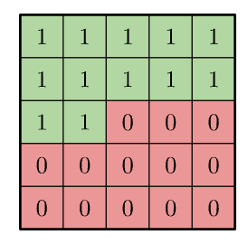
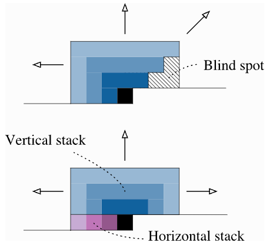

# Computer Vision

## Autoregressive Image Modeling

- For autoregressive image modeling, we predict pixel by pixel in raster scan order. 
- Let's study the PixelCNN Model
- To prevent looking ahead, we use masked convolution kernels
  - [Source](https://arxiv.org/pdf/1606.05328)
  - However, these introduce blind spots, and so we instead use horizontal and vertical convolutions
    - [Source](https://arxiv.org/pdf/1606.05328)
    - Additional explanation
      - Blind spots for 3x3 masked filters: for every feature map (not on the boundary) at position (i,j) does not depend feature maps on (i-1,j+2) in the previous layer.
      - Horizontal stacks look left only, including current spot.
      - Vertical stacks look at all rows at/above the current spot.
        - Note that causality within the same row for vertical stack is not ensured
      - The trick to ensure overall causality is that i-th row in vertical stack will only be used in the computation of (i+1)-th row in horizontal stack.
- Loss Function
  - In PixelCNN, for each pixel, we output 256 logits for each possible pixel value, then compute cross entropy loss.
    - This is costly in terms of memory.
    - In addition, the model doesn't know that pixel value $x$ is close to $x-1$. 
  - In PixelCNN++, we instead assume that the output is a mixture of logistic distributions
    - $P(x \mid \pi, \mu, s)=\sum_{i=1}^K \pi_i\left[\sigma\left(\left(x+0.5-\mu_i\right) / s_i\right)-\sigma\left(\left(x-0.5-\mu_i\right) / s_i\right)\right]$
    - The model then tries to learn the mean and scale parameters for each mixture.

## Vision Transformers 

- We follow [Lippe's implementation](https://github.com/phlippe/uvadlc_notebooks/blob/master/docs/tutorial_notebooks/tutorial15/Vision_Transformer.ipynb) of a vision transformer used for classification. 
- Implementational details:
  - Split an image up into a sequence of $L$ image patches, each image patch is now a "token", where its embedding is a flattened vector of its pixel values. 
  - Add an additional classification token to each sequence, which is initialized with noise. The final embedding for this token is used for classification. 
  - We learn positional encodings which has $L \times Cp_Hp_W$ parameters. Comparing rows dictate the relationship between patches and comparing columns dictate hte relationship between pixels of the same patch. 
    - Convolutional kernels is the normal way we learn these relationships, although these have more restrictions (but are probably easier to learn).