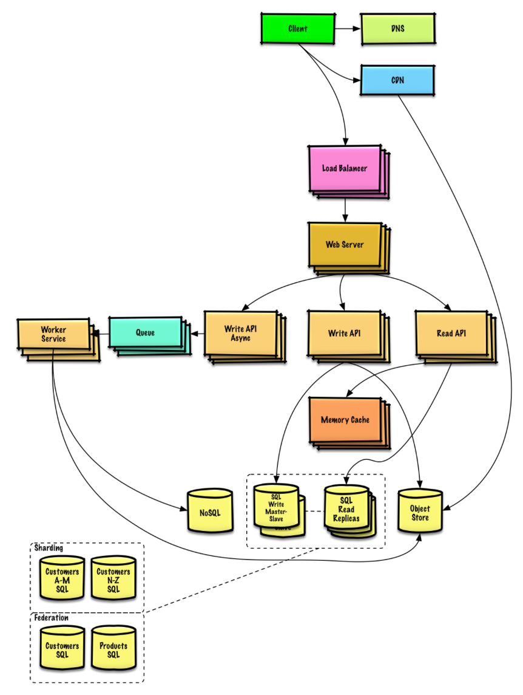
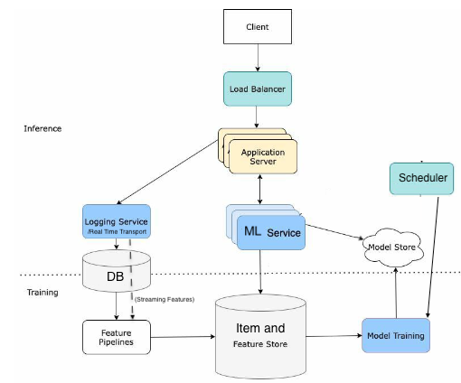

# System Design

## Software Engineering SD
- Framework (from [Xu]((https://www.amazon.com/System-Design-Interview-insiders-Second/dp/B08CMF2CQF)))
  - Understand the problem and establish design scope
    - Why do we want to build this feature?
    - What feature do we want to build?
    - What are the specs? Num users, latency requirements, bandwidth/throughput requirements, compute restrictions?
    - Trends. Where is this going to be in a few months?
  - Propose a high-level design and get buy in
  - Design deep dive (look for guidance here). 
    - Or, identify key issues and redesign. 
  - Recap
- Template Design
  - [Source](https://github.com/donnemartin/system-design-primer?tab=readme-ov-file#push-cdns)
- Concepts
  - User gets the IP address of the load balancer from DNS.
  - Load balancer: evenly distributes incoming traffic among web servers.
  - Database replication
    - Usually master/slave relationship
    - A master generally only supports writes and a slave gets copies from the master and only supports reads.
  - Cache
    - Tradeoffs between consistency and availability
  - Content Delivery Network (CDN)
    - A network of geographically dispersed servers used to deliver static content like images, videos, JavaScript files, etc.
    - Imo, functions as a cache
  - Stateless architecture: 
    - State data (e.g. session data) is stored in a shared data store and kept out of web servers. 
    - This is more scalable but may hinder performance in scenarios requiring frequent state retrieval.
  - Data Center
    - Each (geo-located) data center has its own servers, databases, and caches.
  - Message queues
    - Message queues are stored in memory and support asynchronous communication. 
    - This generally increases reliability too by "checkpointing"
  - Database scaling
    - Vertical
      - Adding more power to the existing machine
    - Horizontal
      - Add more servers
      - Shard databases
        - Vertical: By feature
        - Key-based
        - Directory-based: NEed to maintain a lookup table
      - Normalization
        - Reduces redundancy but slows down joins
  - MapReduce
    - Specifies logic to hash requests and therefore parallelize them.

## Machine Learning SD
- While ML SD questions may involve the SWE SD topics above, there seems to be a greater focus on modeling.
- Template Design (Adapted from [Pham](https://www.amazon.com/Machine-Learning-Design-Interview-System/dp/B09YQWX59Z))
  - 
  - Here, the ML Service can be a few components, e.g. both a Candidate and Ranking service for a recommendation system. 
  - The item and feature store is used as a lookup table for faster inference.
- Framework
  - Understand the problem and establish design scope
    - Why do we want to build this feature? What value would this bring?
    - Why do we need an ML solution?
    - Based on the problem, what are the specs? Num users, latency requirements, bandwidth/throughput requirements, compute restrictions, accuracy, retraining frequency, bandwidth and scale?
  - Propose a high-level design and get buy in
  - Design deep dive (look for guidance here). 
    - Offline and Online Metrics
    - Data
      - Data collection
      - Feature engineering
      - Handling missing values or outliers
      - Handling data imbalance
    - Model details
    - Deployment details
      - Scalability
      - Privacy
      - Maintainability 
  - Recap

## Third-Party Resources
- Load Balancer: AWS Elastic Load Balancing
- DBs
  - AWS, RedShift, Athena support Parquet
  - Relational: Amazon RDS
  - NoSQL: MongoDB, AWS Dynamo
- Servers: AWS, Azure, GCP
- CDNs: Akamai, AWS, Azure, Google Cloud
- Service: Kubernetes can auto-scale the number of pods
- Feature Pipelines: Spark (in-memory computation engine) or Elastic MapReduce or Google Dataproc (cloud-native Spark and Hadoop).
- Feature / Index Stores
  - Realtime approximate nearest neighbors systems - Annoy, Faiss, ScaNN
  - Text indexing systems (Lucene, Elasticsearch)
  - AWS Dynamo provides key-value storage with high availability
- Message Queues: Kafka
- Model Tracking and Management: Kubeflow, MLFlow
- Distributing Model Training: Tensorflow's YARN
- Model Repos: S3
- Multi-purpose: TFX