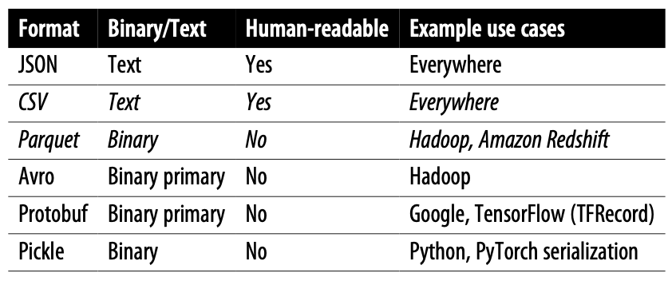
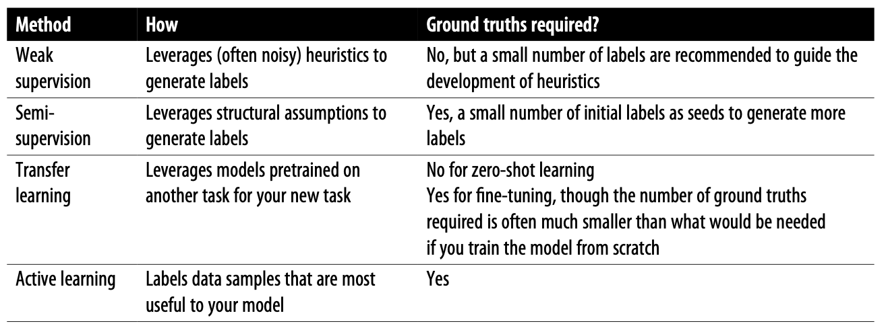

# Notes for Designing Machine Learning Systems by [Huyen](https://www.amazon.com/Designing-Machine-Learning-Systems-Production-Ready/dp/1098107969)

## Introduction
- Requirements
  - Reliability
  - Scalability (and auto-scalability)
  - Maintainability
  - Adaptability

## Data Engineering
- Data Formats
  - Data Serialization: Converting a data structure or object state into a form that can be stored or transmitted and reconstructed later.
  - 
  - CSV is row-major, Parquet is column-major. NumPy is row-major, Pandas is column-major. 
- Data Storage
  - Structured/unstructed data is stored in data warehouses/lakes. Companies need to decide whether to transform extracted data before or after storage. 
- Batch Processing vs Stream Processing
  - Batch: Processing historical data in batches
    - Yields static features e.g. driver ratings
  - Stream: Processing data in real-time transports, e.g. checking which drivers are available
    - Yields dynamic features

## Data Cleaning
- Sampling
  - Nonprobability, Random, Stratified, Weighted
  - Reservoir
    - When dealing with streaming data with unknown $n$, we keep a reservoir with size $k$.
  - Importance
    - Sample from $p(y)$, then weight each sample by $p(x)/p(y)$.
  - Lack of labels
    - 
    - ML is useful for weak supervision when labeling function (LF) doesn't cover all samples
    - Semi-supervision
      - Self-training, iteratively add data points with highest confidence and retrain.
      - Or ask humans to label most uncertain predictions.
      - Label based on nearest neighbors
- Class imbalanace
  - Sampling
    - Two phase: Train with undersample, then fine-tune with all
    - Dynamic sampling: Over and under sample, show the model less of what it has already learnt
  - Loss Functions
    - Weight by 1/sample_size
    - Focal loss (weight rare samples more): Instead of $-\log(p)$, do $-(1-p)^\gamma \log(p)$. 
- Missing Data
  - MNAR (not at random): Reason for missing data is due to the value itself.
  - MAR (at random): Reason for missing data not due to the value itself, but another observable variable.
  - MCAR (completely at random)
- Categorical Data
  - Combine one-hot encoding with hashing
- Data Leaks
  - Suppose a variable causes two samples to be correlated to each other. If we one sample is in train, the other is in test, we would have falsely given credit to our model if we don't expect similar samples to continue occuring in production. Drawing this distinction, however, is tricky.

## Model Development and Offline Evaluation
- Consider learning curves when doing model selection. One may deploy a second model in the background because with enough data it'll catch up. 
- Distributed Training
  - Data Parallelism
    - Synchronous SGD - slower
    - Asynchronous SGD - gradient staleness, but when weight matrices are large, most updates are sparse and it is ok. 
  - Model Parallelism
    - 
- Sampling from predicted probabilities is generally (depending on use case) desirable. This ensures that the model is well calibrated. 

## Model Deployment and Prediction Service
- Prediction
  - Online/synchronous prediction: Google Translate
    - 
    - Optimized for high throughput
  - Batch/asynchronous prediction: Generating movie recommendations for users
    - 
    - Optimized for low latency
- Model Compression
  - Mobile Nets instead of a standard convolution $(K \times K \times C)$, it uses a depth-wise convolution $(K \times K \times 1)$ followed by a point-wise convolution $(1 \times 1 \times C)$
  - Knowledge Distillation: Small model is trained to mimic a larger model
  - Pruning: Removing nodes, or setting weights to 0. We can also retrain the sparse network.
  - Quantization, which also improves computation speed
- Cloud / Edge / Browsers
  - Arguments for Edge
    - Cost of compute
    - Need for network stability
    - Network latency
    - User data 
  - WASM is an open standard that allows you to run executable programs in browsers. However, it is slow.

## Data Distribution Shifts and Monitoring
- Degenerate feedback loops
  - Monitoring
    - Check aggregate diversity or average coverage of long-tailed items
    - Robustness tests based on popularity
  - Solutions
    - Randomization in recommendations
    - Add positional embeddings that you turn off in inference
- Distribution Shifts: K-S tests and other drift detection algorithms.

## Continual Learning and Test in Production
- Continual Learning
  - Deploy when challenger beats champion.
  - Can be trained in a stateless (from scratch) or stateful (checkpointed) manner
  - Bottlenecks include:
    - Speed of labeling (think label computation for behavioral activities)
    - Speed of storing and pulling fresh data
- Deployment Tests
  - Shadow 
  - Canary (which can be used for A/B Testing if properly set up)
  - Interleaving Experiments (mixed AB)
  - Bandits (this concept is also relevant for a single model's recommendations)

## Infrastructure and Tooling
- Storage: On-prem vs Cloud
- Dev Environment
  - Many companies use adhoc tools: Git to version control code, DVC to version data, Weights & Biases or Comet.ml to track experiments during development, and MLflow to track artifacts of models when deploying them.
  - A CI/CD test suite like GitHub Actions and CircleCI is necessary to test your code before pushing it to the staging or production environment. 
  - Standardizing dev environments (like package versions) is very important, and cloud dev environments can help with that.
- Containers
  - Container technology like Docker allows you to re-create an environment on any new instance. 
  - Running all the instructions in a Dockerfile gives you a Docker image (mold). 
  - If you run this Docker image, you get back a Docker container (instance).
  - Different containers may be necessary for different components of your system due to different compute/version requirements.
  - Managing different containers is hard
    - Docker Compose is an orchestrator that can manage containers on a single host
    - When each container runs on its own host, Kubernetes creates a network to help manage containers.  
- Resource Management
  - Crons, Schedulers and Orchestrators
    - Cron: Runs a job at a fixed time
    - Schedulers: Cron programs that can handle dependencies and what to do if a job fails. 
    - Orchestrators: Concerned with where to get resources
  - Workflow management tools: Airflow, Argo, Prefect, Kubeflow, Metaflow
    - Scheduler for the entire workflow
- A deployment service can help with both pushing your models and their depen‐ dencies to production and exposing your models as endpoints.
## The Human Side of ML
- Consistency accuracy tradeoff
- Mostly correct predictions: show multiple
- Latency: Consider using a worse model if a query is going to take longer than usual.
- **Responsible AI**
  - Sources for model biases
    - Training data: Representative of real world? Enough samples of underrepresented groups?
    - Labeling: Subjective biases?
    - Feature engineering: Features don't use legally protected classes. More than that, they are uncorrelated with that too. 
    - Loss function: Works well for all subgroups?
    - Evaluation: Works well for all subgroups?
  - Trade-offs:
    - Privacy vs accuracy
    - Compactness vs fairness