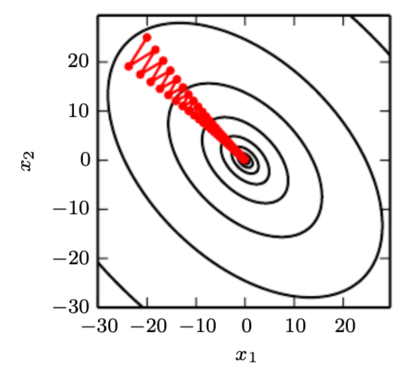

# Optimization

- Gradient Descent
  - Size of learning rate:
    - To the extent that the function that we minimize can be approximated well by a quadratic function, 
      - $f(\mathbf{x}-\epsilon\mathbf{g}) = f(\mathbf{x}) - \epsilon\mathbf{g^{\top}g}+\frac{1}{2}\epsilon^2\mathbf{g^{\top}Hg}$
      - Optimal step size $\epsilon^* = \frac{\mathbf{g^{\top}g}}{\mathbf{g^{\top}Hg}}$
      - In the worst case when $\mathbf{g}$ aligns with the corresponding eigenvector, $\epsilon^* = \frac{1}{\lambda_{max}}$
  - Condition number
    - When the condition number of the Hessian is high, gradient descent performs poorly. 
    - Gradient descent is unaware of the difference in second derivatives, so it does not know to explore in the direction where the derivative remains negative for longer.
    - [Source](https://www.deeplearningbook.org/contents/numerical.html)
- Newton's method
  - Suppose we want to minimize $f(\mathbf{x})$.
  - We use the following update rule: $\mathbf{x}_{k+1}=\mathbf{x}_k-H\left(\mathbf{x}_k\right)^{-1} \nabla f\left(\mathbf{x}_k\right)$
    - $f\left(\mathbf{x}_k+\Delta \mathbf{x}\right) \approx f\left(\mathbf{x}_k\right)+\nabla f\left(\mathbf{x}_k\right)^{\mathrm{T}} \Delta \mathbf{x}+\frac{1}{2} \Delta \mathbf{x}^{\mathrm{T}} H \Delta \mathbf{x}$
    - $\nabla f\left(\mathbf{x}_k+\Delta \mathbf{x}\right) \approx \nabla f\left(\mathbf{x}_k\right)+H \Delta \mathbf{x}$
    - Setting the gradient to be zero gives our update function.
  - Nature of stationary point
    - While in gradient descent, we can ensure that we're moving toward a minima, Newton's method is attracted to all stationary points.
    - Therefore, when the loss function is nonconvex, this method could instead get us to local **maxima**
      - Regularization methods are used to prevent this
  - The time complexity is understandably dominated by inverting the Hessian, which we try to address in Quasi-Newton methods
- Fisher's scoring replaces $H$ with it's expectation, the negative of the Fisher's Information matrix. The advantage of doing so is that this is always positive semi-definite and therefore can aid convergence issues.
- Quasi-Newton methods
  - Quasi-Newton methods avoid computing the inverse of the Hessian by _estimating it through iteration_. Concretely, it uses the following update step:
  - $B_{k+1}\left[\mathbf{x}_{k+1}-\mathbf{x}_k\right]=\nabla f\left(\mathbf{x}_{k+1}\right)-\nabla f\left(\mathbf{x}_k\right)$
    - The intuition here is that we don't want to compute the inverse,  so we iterate on the equation before that.
- Goodfellow's chapter 8 has a lot of interesting discussion here

## Optimization
- Stochastic Gradient Descent (SGD) is mainly done for computational reasons. The expectation of a minibatch is still unbiased.

### Numerical Analysis Methods

## Regularization
### See Statistical Learning Theory

## Additional Tricks